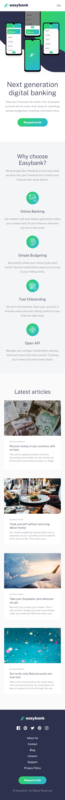
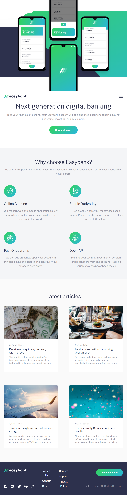
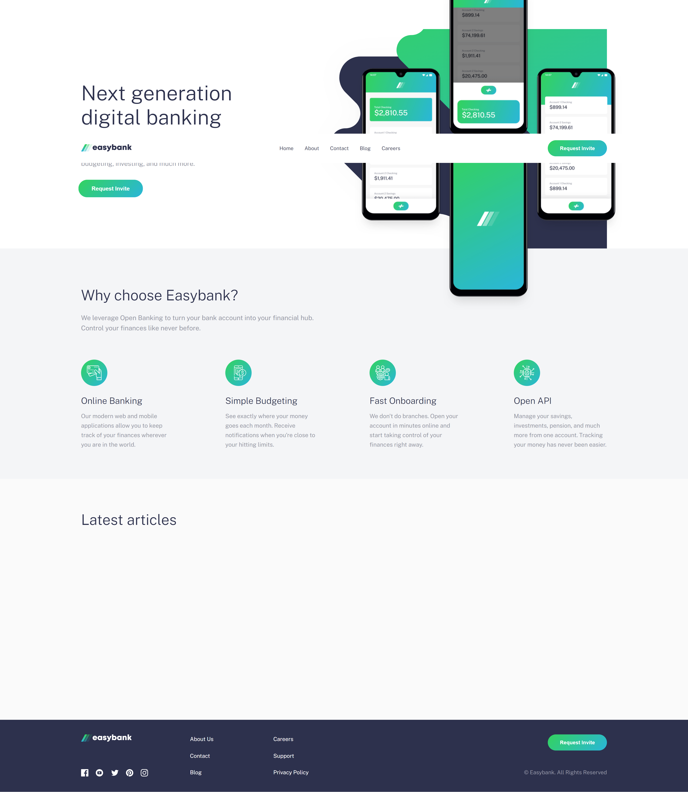

# Frontend Mentor - Easybank landing page solution

Hi!

Thank you for taking your time to review my project.

This is a solution to the [Easybank landing page challenge on Frontend Mentor](https://www.frontendmentor.io/challenges/easybank-landing-page-WaUhkoDN)

## Table of contents

- [Overview](#overview)
- [Screenshot](#screenshot)
- [Built with](#built-with)

## Overview

This project is a standard web page built with SCSS, TypeScript, React.js and some GSAP animations.

The users should be able to:

- View the optimal layout for the site depending on their device's screen size
- See hover states for all interactive elements on the page

## Screenshots

Mobile view:

Tablet view (min. width 768px):

Desktop view: (min-width: 1200px):

## Built with

- SCSS
- TypeScript
- React.js
- GSAP